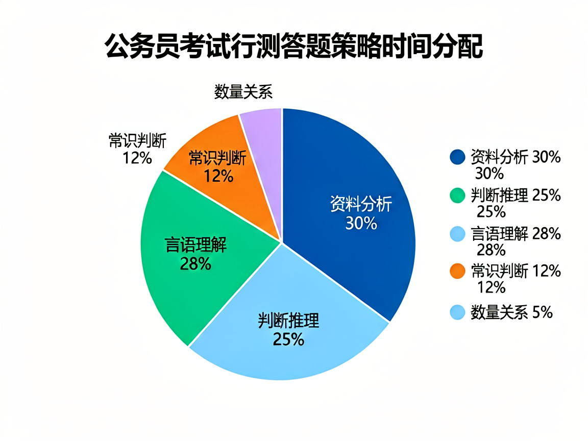
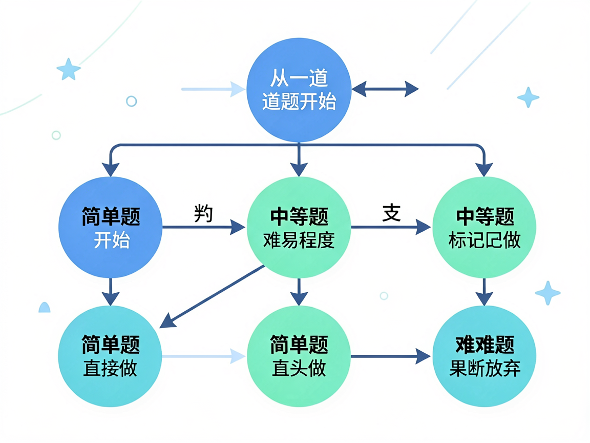

# 行测70分的秘密：不是做得快，而是懂得舍弃

上考场前，小A做了充分的准备。

她报了培训班，刷了三千道题，行测模考稳定在68分左右。她以为自己已经准备好了。

直到那天，真正的国考来了。

120分钟，135道题。她做到了最后一道资料分析的时候，发现时间只剩8分钟。前面的图形推理还空了两道，数量关系一道都没动。

她只能胡乱蒙了几个答案，交了卷子。

成绩出来——58分。和她模考的68分差了整整10分。

她坐在书桌前，盯着那个数字发呆。不是愤怒，而是一种深深的无力感：明明每天都在努力，为什么到了关键时刻，什么都发挥不出来？

这个问题，我相信至少一半的考生都经历过。

*图：考场上最后的15分钟，是决定成败的分水岭*

## 考场上的真相

行测考试有一个残酷的规律：**大多数考生的最终得分，都远低于他们在模拟状态下能达到的水平。**

为什么会这样？

因为模拟考试的时候，时间是充裕的，心态是放松的。你有足够的时间去思考每一道题——哪怕是那些本来就不该花太多时间的题。

而真正的考场不一样。时间压力会扭曲你的判断。

一道图形推理题，你在平时训练时可能需要3-5分钟才能找到规律。但在考场上，如果你花了3分钟还没做出来，你的潜意识会告诉你"这道题不简单，一定要攻克它"——于是你又花了2分钟。结果，原本应该留给三道资料分析的10分钟，没了。

这就是所谓的"**沉没成本陷阱**"：你已经投入的时间，让你舍不得放手，即使继续投入的预期回报已经是负的。

一个行测高分考生，和普通考生的最大区别不在于谁更聪明、谁刷题更多——而在于**谁更敢于在一道题上及时止损**。

考场上的高手，都是"放弃"的高手。

这不是消极，这是一种高级的资源分配能力。

## 一道题背后的数学

让我们做一个简单的算术。

行测满分100分，共135道题。平均每题分值不到0.74分。

但实际上，不同模块的分值分布是不均匀的：

| 模块 | 题量 | 每题分值估算 | 单题性价比 |
|------|------|-------------|-----------|
| 常识判断 | 20 | 0.5分 | 低 |
| 言语理解 | 40 | 0.8分 | 中 |
| 判断推理 | 35 | 0.9分 | 中高 |
| 资料分析 | 20 | 1.2分 | 高 |
| 数量关系 | 20 | 1.0分 | 中 |

看到了吗？资料分析的每道题价值最高，其次是判断推理。数量关系和常识判断的单题价值最低。

但绝大多数考生的答题顺序和时间分配是怎样的？

从常识开始——分值最低的模块之一。遇到拿不准的就花时间去想。然后看言语——分值中等。图推题卡住了，反复纠结。

等做到最后的资料分析，时间已经不多了。原本单题价值最高的模块，反而变成了最仓促的部分。

**这是一个典型的资源错配：你花了最多的时间在产出最低的地方。**

## 正确的答题策略

那么，一个理性的考生应该如何分配时间和精力？

我有一个朋友，某头部公考培训机构的教研主管。他说，他们内部培训高分学员的时候，有一条不成文的"三秒法则"：

**一道题，如果三秒之内你没有思路，就先跳过。**

这不是说那道题你不该做，而是你的大脑在那个当下还没有进入最佳状态。跳过它，去做下一道你有把握的题，等完成了整个试卷的"确定性部分"，再回过头来重新审视那些被你标记过的题。

因为很多时候，你的思路是在"切换"的过程中被激活的。做了一道言语理解题后，你的语感被唤醒了，再回来看刚才那道图形推理，可能就瞬间有感觉了。

但这需要你对整个考场的"时间蛋糕"有清晰的规划。

*图：时间管理的本质是价值的最大化分配*

一个典型的70+分考生的时间分配模型是这样的：

- **常识判断**：快速过一遍，拿不准的直接蒙，总共控制在8分钟内。这道题不需要"想"，靠的是平时的积累。
- **言语理解**：平均每道题1分钟。遇到特别长的题干不要慌，先抓关键词，找主干。控制在35-40分钟。
- **判断推理**：图推题15秒没有思路就猜一个，标记后回头再看。逻辑判断和定义判断各给1-1.5分钟。总共控制在45分钟内。
- **资料分析**：这是重中之重。每篇材料5-6分钟，先读问题再回材料找数据，不用硬算。20道题控制在30分钟以内。
- **数量关系**：只做3-5道你有绝对把握的题（工程问题、行程问题），其余蒙同一个选项。控制在5-8分钟。

整个过程，大概有15-20道题是直接从第一轮跳过的。这不是因为你不会——而是因为你选择把有限的考试时间投入到**产出最高的地方**。

这就叫"战略性舍弃"。

## 舍弃矩阵：什么题该放弃，什么题该死磕

不是所有的"舍"都是一样的。这里有一个实用的舍弃决策矩阵：

| 题型 | 你有思路？ | 行动 | 理由 |
|------|-----------|------|------|
| 常识判断 | 有 | 直接选 | 单题价值低，不值得花时间 |
| 常识判断 | 无 | 蒙一个，标记回头 | 纯运气题，回头也不会更好 |
| 言语理解 | 有 | 正常做 | 分值中等，是稳定的得分来源 |
| 言语理解 | 无 | 找关键词，猜一个 | 语感题，想多了反而错 |
| 图形推理 | 有思路 | 给15秒限时 | 超时就跳过 |
| 图形推理 | 无思路 | 直接蒙 | 不要犹豫 |
| 资料分析 | 任何情况 | 全力做 | 单题分值最高，是拉分的关键 |
| 数量关系 | 有思路 | 做 | 分值不错，能做一道是一道 |
| 数量关系 | 无思路 | 全部蒙C | 集中蒙同一个选项收益最高 |

这里面最值得记住的一条规则是：**资料分析永远是优先级最高的。**

哪怕前面所有模块你都做得稀烂，只要资料分析做到90%以上的正确率，总分就一定不会低。因为这是唯一一个靠方法论可以快速提分的模块。

而数量关系，恰恰相反——它是方法论最难以在短时间内见效的模块。与其花一个月时间啃数量关系的各种难题，不如把同样的时间花在资料分析的速算技巧上。

这就是"用杠杆思维做选择题"。

*图：考场上的每一次选择，都应该基于价值判断*

## 为什么"做完所有题"是一个陷阱

很多考生在考前给自己定下的目标是"把所有题做完"。这是一个非常经典但非常错误的目标。

原因很简单：国考行测的设计本身就不是让你做完的。

命题人心里很清楚，135道题用120分钟做完，平均每道题不到53秒。这个数字在常识和数量关系层面是完全合理的——但对于言语理解和资料分析来说，53秒远远不够。

所以，命题人从一开始就没有期望你做完所有题。他们期望你做对的，是那些**分值高、你最有把握的题**。

那些你最后来不及做的题，不是因为你不够快——而是因为你把不该花时间的事情，安排在了错误的位置。

> **误区提醒**：不要试图训练"快速做完所有题"，而应该训练"在规定时间内做对最多的题"。前者追求的是速度，后者追求的是效率。

## 练习的策略变了

明白了上面的逻辑之后，你在日常练习时的方法也应该做出调整。

以前你可能这样练习：

- 一套真题，从第一题做到最后一题
- 做完对答案，算总分
- 分析一下错题，下次注意

这套方法本身没有问题。但问题在于，它训练的是"你平时能得多少分"，而不是"你在考场上能得多少分"。

试试这个方法：

**第一阶段：按模块刷题。**先把资料分析练到正确率90%以上，把判断推理练到方法论肌肉记忆。这个阶段不计时，只求正确率。

**第二阶段：限时做部分模块。**比如只计时做资料分析+判断推理，要求在55分钟内完成，正确率达到85%以上。这是在训练"确定性模块"的速度。

**第三阶段：全真模拟，带着策略。**严格按照上面的时间分配模型来做题。常识8分钟，言语40分钟……做完之后再对比：你在每个环节的时间消耗是否跟计划一致？哪些题本该跳过却浪费了时间？

这个过程的核心不是"多做题"，而是**建立你的"考场节奏感"**。

当你走上考场的那一刻，你的大脑里应该有一张"作战地图"——哪道题先做，哪道题跳过，哪个模块是重点投入的对象。你不是在做题，你是在执行一个预先制定好的战术计划。

> **练习建议**：每周至少进行一次全真模拟，严格按照120分钟倒计时，并按照你的舍弃策略做题。把真实的考场体验培养成肌肉记忆，才是真正的考场竞争力。

## 一个朴素的结论

国考行测这门考试，表面上考的是你的知识储备和思维能力，但底层考的其实是**你的决策质量和资源分配能力**。

选岗时，你需要在几千个岗位里做出最优选择——不是选最好的，而是选最适合你的。

考场上，你需要在135道题里决定哪些做、哪些跳过——不是全部做完，而是做对你最有价值的。

备考过程中，你需要在三种资源（时间、精力、注意力）有限的前提下做分配——不是平均用力，而是重点突破。

这三件事的本质是一样的：**做选择，并且为选择承担后果。**

那些能在国考中最终上岸的人，未必是做题做得最快的人。但他们一定是**最舍得放弃的人**——放弃那些看似能做但不值得做的题，放弃那些干扰你目标的情绪和内耗，放弃那些"所有人都这么做，所以我也这么做"的路径依赖。

舍，是为了得。

你舍掉的每一道题，都是在为更重要的得分腾出时间。你舍弃的每一分焦虑，都在让你离上岸更近一步。

下一次做题的时候，试着不去想"我能不能做完"，而是去想**"我该怎么分配"**。

这个思维方式一旦转变，你会发现——行测根本不是考试，而是你人生中每一次重要决策的一次预演。

---

> 本文作者整理了涵盖**岗位筛选、行测提分、申论模板、时政背诵、面试政审**的完整备考工具包，所有内容均为原创手工整理，覆盖了从选岗到上岸的全流程。如果你想系统性地准备国考，可以访问 gk.minicode.cloud 了解详情。
